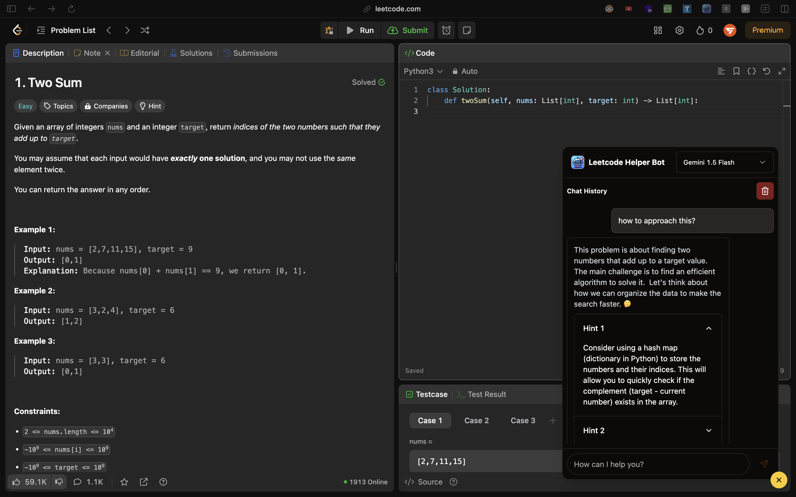

<a id="readme-top"></a>

<!-- LOGO -->

<div align="center">
  <a href="https://chromewebstore.google.com/detail/leetcode-helper-bot/pnplpijgjhkfcbkpbpemoaijflgapfnc" target="_blank">
    
  </a>

  <h3 align="center">Leetcode Helper Bot</h3>

  <p align="center">
    A browser extension designed to assist users in solving LeetCode problems by providing real-time information, tools, and support for multiple models.
    <br />
    <a href="https://chromewebstore.google.com/detail/leetcode-helper-bot/pnplpijgjhkfcbkpbpemoaijflgapfnc" target="_blank">View Demo</a>
    ·
    <a href="https://github.com/sahilverma-dev/leetcode-helper-extension/issues/new?labels=bug&template=bug-report---.md">Report Bug</a>
    ·
    <a href="https://github.com/sahilverma-dev/leetcode-helper-extension/issues/new?labels=enhancement&template=feature-request---.md">Request Feature</a>
  </p>
</div>

<!-- TABLE OF CONTENTS -->
<details>
  <summary>Table of Contents</summary>
  <ol>
    <li>
      <a href="#about-the-project">About The Project</a>
      <ul>
        <li><a href="#features">Features</a></li>
        <li><a href="#built-with">Built With</a></li>
      </ul>
    </li>
    <li>
      <a href="#getting-started">Getting Started</a>
      <ul>
        <li><a href="#prerequisites">Prerequisites</a></li>
        <li><a href="#installation">Installation</a></li>
      </ul>
    </li>
    <li><a href="#usage">Usage</a></li>
    <li><a href="#roadmap">Roadmap</a></li>
    <li><a href="#contributing">Contributing</a></li>
    <li><a href="#license">License</a></li>
    <li><a href="#contact">Contact</a></li>
    <li><a href="#acknowledgments">Acknowledgments</a></li>
  </ol>
</details>

<!-- ABOUT THE PROJECT -->

## About The Project




This project is a browser extension designed to assist users in solving LeetCode problems by providing real-time information and tools.

### Features

- **Real-time Problem Information**: Fetch and display problem details directly from LeetCode.
- **Chat Interface**: Interact with the bot to get hints and guidance on solving problems.
- **Syntax Highlighting**: View code snippets with syntax highlighting for better readability.
- **Chat History**: Maintain a history of your interactions with the bot.
- **Dark Mode Support**: Automatically switch between light and dark themes based on user preference.
- **User-Friendly Interface**: Easy-to-use interface for seamless interaction.
- **Multiple Model Support**: Supports multiple models for diverse problem-solving approaches.

### Built With

- [React](https://reactjs.org/) - A JavaScript library for building user interfaces.
- [TypeScript](https://www.typescriptlang.org/) - A typed superset of JavaScript that compiles to plain JavaScript.
- [Framer Motion](https://www.framer.com/motion/) - A library for animations in React.
- [React Syntax Highlighter](https://github.com/react-syntax-highlighter/react-syntax-highlighter) - A library for syntax highlighting in code snippets.
- [Chrome Extensions API](https://developer.chrome.com/docs/extensions/mv3/) - For building the browser extension.
- [Vercel AI SDK](https://vercel.com/docs/api#endpoints/ai) - Used for deploying and managing AI models.
- [Google Gemini](https://cloud.google.com/gemini) - A large language model developed by Google.
- [OpenAI](https://openai.com/) - A leading AI research organization and developer of the GPT series of language models.
- [Claude](https://www.anthropic.com/claude) - A large language model developed by Anthropic.

## Getting Started

To get a local copy up and running, follow these steps.

### Prerequisites

- Node.js (v14 or later)
- npm (Node Package Manager)

### Installation

1. Clone the repo
   ```bash
   git clone https://github.com/sahilverma-dev/leetcode-helper-extension
   ```
2. Navigate to the project directory
   ```bash
   cd leetcode-helper-extension
   ```
3. Install the required packages
   ```bash
   npm install
   ```
4. Build the project
   ```bash
   npm run build
   ```
5. Load the extension in your browser:
   - Open Chrome and go to `chrome://extensions/`
   - Enable "Developer mode"
   - Click "Load unpacked" and select the `build` directory of your project.

## Usage

1. Open the LeetCode website and navigate to a problem.
2. Click on the LeetCode Helper Bot extension icon in your browser.
3. Interact with the bot to get hints and guidance on solving the problem.
4. Use the chat interface to maintain a history of your interactions.

## Roadmap

- [ ] Add more features for enhanced user experience.
- [ ] Improve the chat interface with more interactive elements.
- [ ] Implement user authentication for personalized experiences.
- [ ] Expand support for additional coding platforms.

## Contributing

Contributions are what make the open-source community such an amazing place to learn, inspire, and create. Any contributions you make are **greatly appreciated**.

1. Fork the Project
2. Create your Feature Branch (`git checkout -b feature/AmazingFeature`)
3. Commit your Changes (`git commit -m 'Add some AmazingFeature'`)
4. Push to the Branch (`git push origin feature/AmazingFeature`)
5. Open a Pull Request

## License

Distributed under the MIT License. See `LICENSE` for more information.

## Contact Me

- **Email:** [sahilverma.webdev@gmail.com](mailto:sahilverma.webdev@gmail.com)
- **Portfolio:** [sahilverma.dev](https://sahilverma.dev/)
- **GitHub:** [@sahilverma-dev](https://github.com/sahilverma-dev)
- **Twitter:** [@sahilverma_dev](https://twitter.com/sahilverma_dev)
- **LinkedIn:** [sahilverma-dev](https://www.linkedin.com/in/sahilverma-dev/)

## Acknowledgments

- [Google Chrome](https://www.google.com/chrome/) for providing the Chrome Extension platform.
- [Node.js](https://nodejs.org/) for the server-side runtime environment.
- [npm](https://www.npmjs.com/) for package management.
- [React](https://reactjs.org/) for the front-end framework.
- [TypeScript](https://www.typescriptlang.org/) for static typing and better code maintainability.
- [GitHub](https://github.com/) for hosting the project and facilitating collaboration.
- [Gemini](https://gemini.ai/) for providing the AI model.
- [LeetCode](https://leetcode.com/) for the coding challenges.
- [React Community](https://reactjs.org/community/support.html) for their support and resources.

<p align="right">(<a href="#readme-top">back to top</a>)</p>
